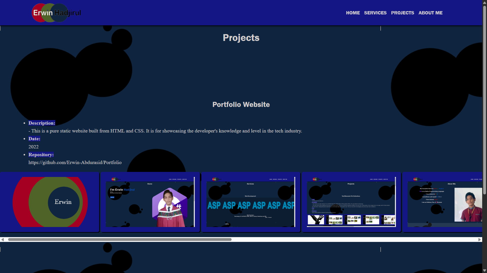
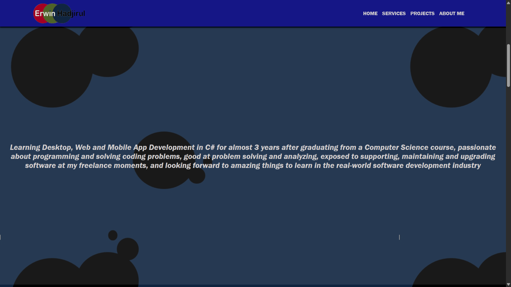

#  Portfolio Website

 

 

 

 

---

## Table of Contents

1. [Introduction](#introduction)

---

## Introduction

Welcome to my **Portfolio Website**. This is a pure static website built from HTML and CSS. It is for showcasing my knowledge and level in the tech industry.

---

### Note:

- The owner's information about his career as a programmer and web developer is all included in this simple website.

- This is his ***first time*** developing a website. That's why copying the source code from this repository (of this website) is not appropriate.